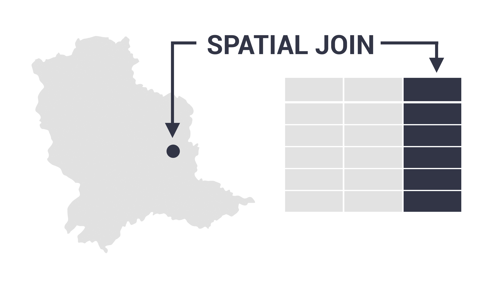

# Spatial Join with ArcGIS

  

## Objective & Purpose
The objective of this project is to use Arcpy sptail join function to perform common spatial join tasks. The purpose is to learn how to reproduce the work using the python script instead of the ArcGIS GUI interface. 

## How to run it locally
1. Make sure you have ArcGIS Pro installed on your local machine or have the environmental file that can run Arcpy. 
2. Clone this repo to your local machine.
3. Unzip the **data.zip**.
4. Activate your environment and then open the **index.ipynb** to run the code. 
